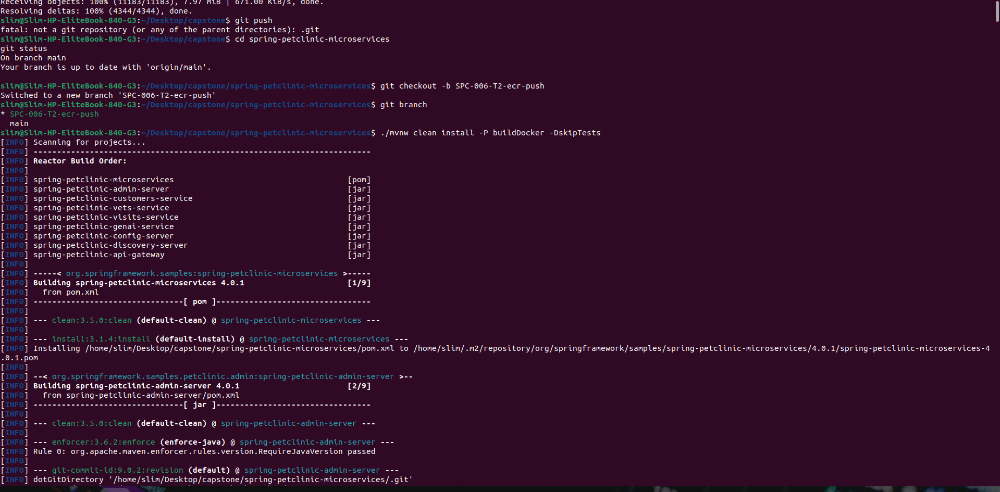
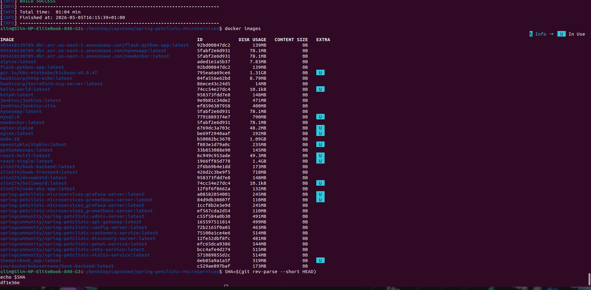
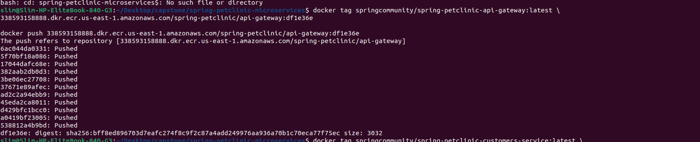
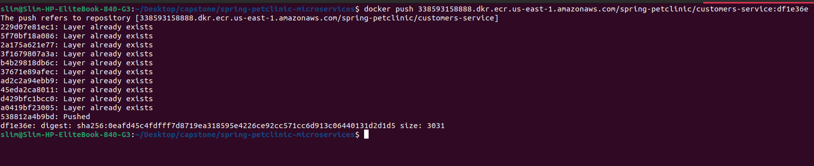
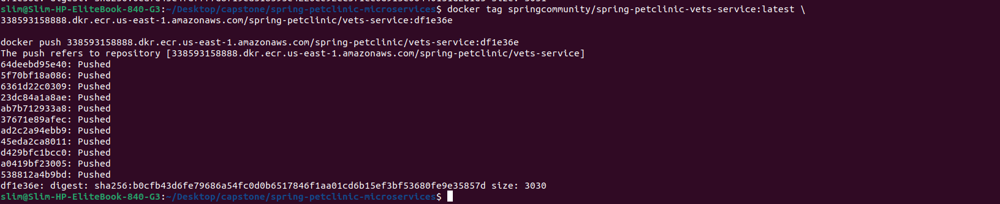
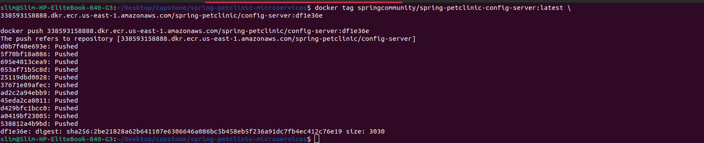
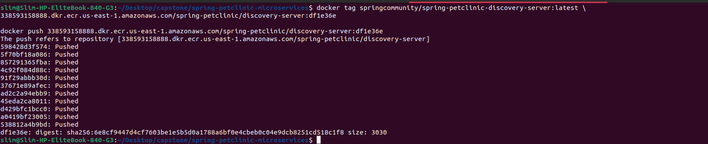
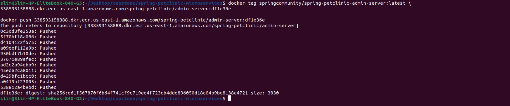
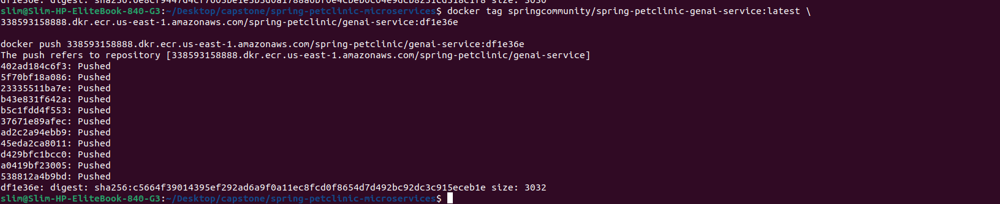

# SPC-006-T2 - Test All Service Images Build Successfully and Push to ECR

## Objective

Build, tag, and push Spring PetClinic microservice Docker images to AWS Elastic Container Registry (ECR) using Git commit SHA tags.

---

## Branch Name

`SPC-006-T2-ecr-push`

---

## Git Commit SHA

`df1e36e`

---

# Maven Build Process

The following command was used to build all Docker images locally:

```bash
./mvnw clean install -P buildDocker -DskipTests
```



---

# Docker Images Verification

Verified generated Docker images locally using:

```bash
docker images
```



---

# AWS ECR Authentication

Authenticated Docker to AWS ECR using AWS CLI:

```bash
aws ecr get-login-password --region us-east-1 | docker login --username AWS --password-stdin 338593158888.dkr.ecr.us-east-1.amazonaws.com
```

---

# AWS ECR Repository Verification

Verified repositories successfully created in AWS ECR.


---

# Successfully Pushed Services

## API Gateway

Repository:

```text
spring-petclinic/api-gateway
```



---

## Customers Service

Repository:

```text
spring-petclinic/customers-service
```



---

## Vets Service

Repository:

```text
spring-petclinic/vets-service
```



---

## Visits Service

Repository:

```text
spring-petclinic/visits-service
```


---

## Config Server

Repository:

```text
spring-petclinic/config-server
```



---

## Discovery Server

Repository:

```text
spring-petclinic/discovery-server
```



---

## Admin Server

Repository:

```text
spring-petclinic/admin-server
```



---

## GenAI Service

Repository:

```text
spring-petclinic/genai-service
```



---

# Steps Performed

1. Cloned the repository
2. Used feature branch:
   `SPC-006-T2-ecr-push`
3. Built Docker images using Maven
4. Generated Git commit SHA
5. Configured AWS CLI
6. Authenticated Docker with AWS ECR
7. Tagged Docker images
8. Pushed images to official team ECR repositories
9. Verified image uploads in AWS ECR

---

# Challenges Encountered

- Initial ECR authentication issue
- Repository naming mismatch
- Missing repositories during first push attempt

---

# Resolution

- Re-authenticated Docker using AWS CLI
- Switched to official team ECR repositories:
  `spring-petclinic/<service-name>`
- Re-tagged and re-pushed images successfully

---

# Outcome

Successfully built, tagged, pushed, and verified Spring PetClinic microservice Docker images in AWS Elastic Container Registry (ECR) using Git commit SHA tags.

All required backend microservice images were successfully uploaded to the official team repositories.